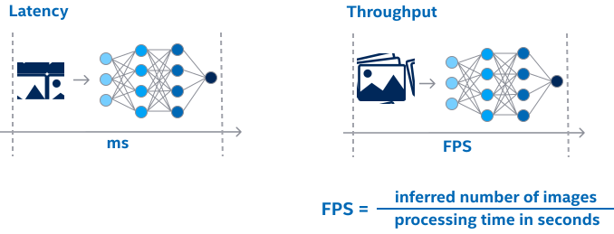

# Performance Optimization Guide {#openvino_docs_optimization_guide_dldt_optimization_guide}

Before exploring optimization techniques, let us first define what performance is and how it is measured.

### What Is Performance 

Performance means how fast the model is in deployment. Two key metrics are used to measure performance: latency and throughput. 

Latency measures inference time (ms) required to process a single input. When it comes to batch input need to measure throughput (images per second or frames per second, FPS). To calculate throughput, divide number of frames that were processed by the processing time.   

> **NOTE**: To get performance numbers for OpenVINO, as well as tips how to measure it and compare with native framework, check [Getting performance numbers](../MO_DG/prepare_model/Getting_performance_numbers.md) page.
 
### How to Improve Performance 

> **NOTE**: Make sure that your model can be successfully inferred with OpenVINO Inference Engine. 

Inside OpenVINO there are two ways how to get better performance number: during developing and deployment your model. **It is possible to combine both developing and deployment optimizations**. 

- **developing step** includes model modification. Inside developing optimization there are three ways to optimize your model:  

    - **Post-training Optimization tool** (POT) is designed to optimize the inference of deep learning models by applying special methods without model retraining or fine-tuning, like post-training quantization.  

    - **Neural Network Compression Framework (NNCF)** provides a suite of advanced algorithms for Neural Networks inference optimization with minimal accuracy drop, available quantization, pruning and sparsity optimization alorithms.

    - **Model Optimizer** implement some optimization to a model, most of them added by default, but you can configure mean/scale values, batch size RGB vs BGR input channels and other parameters to speed-up preprocess of a model ([Additional Optimization Use Cases](../MO_DG/prepare_model/Additional_Optimizations.md)) 

- **deployment step**  includes tuning inference parameters and optimizing model execution, to read more visit [Deployment Optimization Guide](../optimization_guide/dldt_deployment_optimization_guide.md).

More detailed workflow: 

To understand when to use each development optimization tool, follow this diagram: 

POT is the easiest way to get optimized models and it is also really fast and usually takes several minutes depending on the model size and used HW. NNCF can be considered as an alternative or an addition when the first does not give accurate results. 

